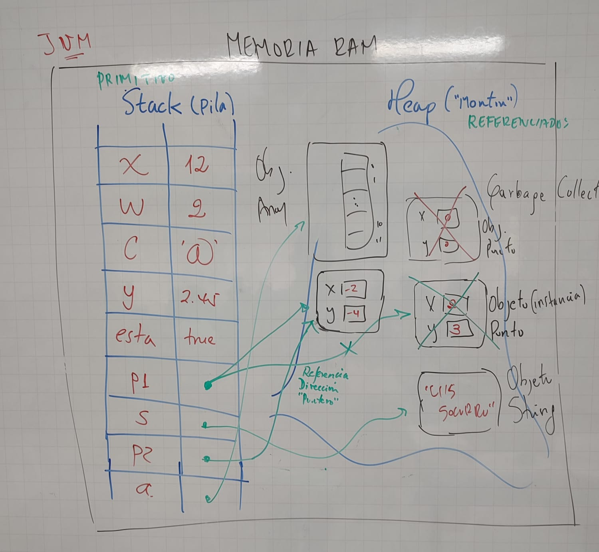

# TIPOS DE DATOS EN JAVA

## JVM (Java Virtual Machine)
* Realiza una gestión eficiente de la memoria.
* Distribuye la memoria en dos zonas: stack (pila) y heap (montón).

### Stack
* Se almacenan: variables locales, llamadas a métodos (parámetros y resultados), variables primitivas, referencias a objetos del heap. 
* Memoria estática.

### Heap 
* Es gestionado por el Garbage Collector.
* Espacio de memoria en tiempo de ejecución donde se registran los objetos.
* Memoria dinámica.
* No posee estructura de asignación de espacios.

### Variable
* Contenedor de memoria donde se almacena información.
* En Java se declara con un tipo que se conservará durante todo su ciclo de vida en el interior de la aplicación.
* La variable debe tener un nombre.
* Existen de tipo primitivo y referenciado.

## PRIMITIVOS
* Contenedores de tamaño específico que almacena valores y no tiene métodos.
* Ejemplos: boolean, char, byte, short, long, float, double.

## REFERENCIADOS
* Almacenan las referencias a los datos.
* Estos datos se escriben en una zona de memoria llamada heap.
* Espacio de memoria en tiempo de ejecucion donde se registran los objetos.
* Accesible dede otras instancias de clase.
* Su ciclo de vida termina cuando no necesita mas.
* Mientras exista al menos una referencia activa en la zona de datos esta se mantendra.
* Tan pronto como no haya mas referencias, la zona se considera no utilizada y preocede a su destruccion por parte del Garbage Collector.
* Un tipo referenciado puede no referenciar nada -> null.
* new : instanciacion de una clase. Reserva una direccion de un area de memoria.

### Variable de referencia 
* Caracteriza una instancia de clase, es decir la direccion  de donde esta el objeto.
* Contiene la direccion de un objeto, cuyo valor por defecto es null.
* Durante una prueba e igualdad entre dos variables por refencia, sin las direcciones de los objetos lo que se compara, y no el contenido de los objetos en si mismos.
* Cuando se usa una referencia como argumento de un metodo es la direccion del objeto lo que se pasa, y no el objeto en si mismo.